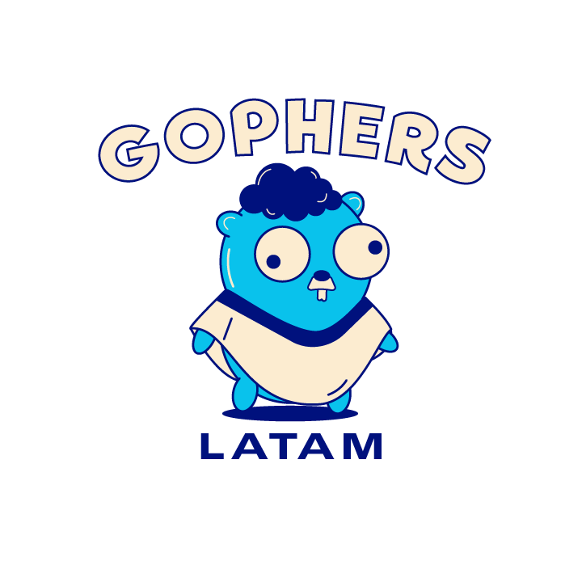

# 🤔Como utilizar el tour? 
Para poder usar el tour en español, lo primero que debes de verificar es:
- Tener instalado Git.
- Tener instalado Go.

Una vez verificado estos pasos, deberás ejecutar el siguiente comando en tu terminal o en tu editor de código favorito:

```bash
git clone https://github.com/gophers-latam/go-tour-es
```
o también

```go
go install -u https://github.com/gophers-latam/go-tour-es
// luego en tu terminal ejecutas: ./go-tour-es
```

## ⚠️ Reportar issues

Para reportar un error de traducción o simplemente aportar al proyecto, puedes
crear un issue al siguiente repositorio: https://github.com/gophers-latam/go-tour-es

Las traducciones se encuentran en la ruta: go-tour-es/tour/content/

Cualquier issue y pull request son bienvenidos.

